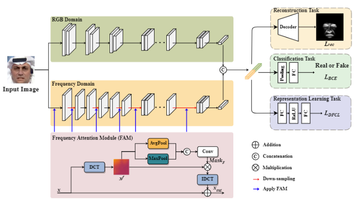

# Exploring Frequency Attention Learning and Contrastive Learning for Face Forgery Detection

## Overview



## Setup

This repository is build upon Python v3.7 and Pytorch v1.10.0 on Ubuntu 18.04. 

You have to request datasets from:

[FaceForensics ++ : Learning to Detect Manipulated Facial Images](https://github.com/ondyari/FaceForensics)

### For training:

The default baseline model is xception. If the datasets mentioned above are ready to use, run:

```
python train.py [-h] [--w1 W1] [--w2 W2] [--gpu GPU]
                [--compress COMPRESS] [--bz BZ]
                [--pretrained_path PRETRAINED_PATH] [--epoch EPOCH]
                [--lr LR] [--mode MODE] [--model_path MODEL_PATH]

```
```
w1:the weight of mask loss.
w2:the weight of DFCL loss.
compress:the quality of image, including raw,c23,c40.
mode:the mode of training, including Original,Two_stream,FAM,Decoder,CLloss.
```
